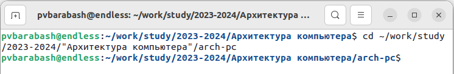

---
## Front matter
title: "Отчёт по лабораторной работе"
subtitle: "Лабораторная №2"
author: "Полина Витальевна Барабаш"

## Generic otions
lang: ru-RU
toc-title: "Содержание"

## Pdf output format
toc: true # Table of contents
toc-depth: 2
lof: true # List of figures
fontsize: 12pt
linestretch: 1.5
papersize: a4
documentclass: scrreprt
## I18n polyglossia
polyglossia-lang:
  name: russian
  options:
	- spelling=modern
	- babelshorthands=true
polyglossia-otherlangs:
  name: english
## I18n babel
babel-lang: russian
babel-otherlangs: english
## Fonts
mainfont: PT Serif
romanfont: PT Serif
sansfont: PT Sans
monofont: PT Mono
mainfontoptions: Ligatures=TeX
romanfontoptions: Ligatures=TeX
sansfontoptions: Ligatures=TeX,Scale=MatchLowercase
monofontoptions: Scale=MatchLowercase,Scale=0.9
## Biblatex
biblatex: true
biblio-style: "gost-numeric"
biblatexoptions:
  - parentracker=true
  - backend=biber
  - hyperref=auto
  - language=auto
  - autolang=other*
  - citestyle=gost-numeric
## Pandoc-crossref LaTeX customization
figureTitle: "Рис."
listingTitle: "Листинг"
lofTitle: "Список иллюстраций"
lolTitle: "Листинги"
## Misc options
indent: true
header-includes:
  - \usepackage{indentfirst}
  - \usepackage{float} # keep figures where there are in the text
  - \floatplacement{figure}{H} # keep figures where there are in the text
---

# Цель работы

Целью работы является изучить идеологию и применение средств контроля версий. Приобрести практические навыки по работе с системой git.

# Выполнение работы

**Задание №1.** Создайте учётную запись на сайте https://github.com/ и заполните основные данные.
Я создала учётную запись на сайте https://github.com/ и заполнила основые данные.

{#fig:001 width=100%}

**Задание №2.** Сделайте предварительную конфигурацию git. Откройте терминал и введите следующие команды, указав имя и email владельца репозитория: 
git config --global user.name "<Name Surname>" 
git config --global user.email "<work@mail>"

Настройте utf-8 в выводе сообщений git: 
git config --global core.quotepath false

Задайте имя начальной ветки (будем называть её master): 
git config --global init.defaultBranch master

Задайте параметр autocrlf и параметр safecrlf: 
git config --global core.autocrlf input
git config --global core.safecrlf warn

Сначала я сделала предварительную конфигурацию git.

{#fig:002 width=100%}

Затем я настроила utf-8 в выводе сообщений git.

{#fig:003 width=100%}

Я задала имя начальной ветки.

{#fig:004 width=100%}

Я задала параметр autocrlf.

{#fig:005 width=100%}

И задала параметр safecrlf.

{#fig:006 width=100%}

**Задание №3.** Для последующей идентификации пользователя на сервере репозиториев необходимо сгенерировать пару ключей (приватный и открытый):
ssh-keygen -C "Имя Фамилия <work@mail>"

Далее необходимо загрузить сгенерённый открытый ключ. Для этого зайти на сайт http: //github.org/ под своей учётной записью и перейти в меню Setting . После этого выбрать в боковом меню SSH and GPG keys и нажать кнопку New SSH key. Скопировав из локальной консоли ключ в буфер обмена, вставить ключ в появившееся на сайте поле и указать для ключа имя (Title).

Я сгенерировала пару ключей (приватный и открытый). Ключи сохранились в каталоге ~/.ssh/.

{#fig:007 width=100%}

Я скопировала сгенерённый открытый ключ с помощью команды cat ~/.ssh/id_rsa.pub | xclip -sel clip.

{#fig:008 width=100%}

Я зашла на сайт http: //github.org/ под своей учётной записью, перешла в меню Setting, выбрала в боковом меню SSH and GPG keys и, нажав на кнопку New SSH key, загрузила скопированный в буфер обмена сгенерённый открытый ключ. Указала имя для ключа.

{#fig:009 width=100%}

**Задание №4.** Откройте терминал и создайте каталог для предмета «Архитектура
компьютера»:
mkdir -p ~/work/study/2023-2024/"Архитектура компьютера"

Я создала каталог предмета “Архитектура компьютера” и проверила, что он существует с помощью команды ls.

{#fig:010 width=100%}

**Задание №5.** Перейдите на страницу репозитория с шаблоном курса https://github.com/yamadharma/cour se-directory-student-template. Далее выберите Use this template. В открывшемся окне задайте имя репозитория (Repository name) n и создайте репозиторий (кнопка Create repository from template). Откройте терминал и перейдите в каталог курса: 
cd ~/work/study/2023–2024/"Архитектура компьютера"

Клонируйте созданный репозиторий:
git clone --recursive git@github.com:/study_2023–2024_arh-pc.git arch-pc

Я перешла на страницу репозитория с шаблоном курса и выбрала Use this template.
Далее был предоставлен выбор Create a new repository или Open in a codespace.

{#fig:011 width=100%}

Я выбрала Create a new repository и увидела нужные поля для заполнения.

{#fig:012 width=100%}

Я задала имя репозитория (Repository name) study_2023–2024_arhpc и создала репозиторий (кнопка Create repository).

{#fig:013 width=100%}

Я открыла терминал и перешла в каталог курса.

{#fig:014 width=100%}

Я клонировала созданный репозиторий, скопировав ссылку для клонирования на
странице созданного репозитория Code.

{#fig:015 width=100%}

Через файловый менеджер я проверила, что репозиторий клонирован.

{#fig:016 width=100%}

**Задание № 6.** Перейдите в каталог курса:
cd ~/work/study/2023-2024/"Архитектура компьютера"/arch-pc

Удалите лишние файлы:
rm package.json

Создайте необходимые каталоги:
echo arch-pc > COURSE
make

Отправьте файлы на сервер:
git add .
git commit -am 'feat(main): make course structure'
git push

Проверьте правильность создания иерархии рабочего пространства в локальном
репозитории и на странице github.

Я перешла в каталог курса, используя данный абсолютный путь.

{#fig:017 width=100%}

Я удалила лишние файлы.

{#fig:018 width=100%}

Я создала необходимые каталоги.

{#fig:019 width=100%}

Я отправила файлы на сервер. Выдача после git commit -am 'feat(main): make course structure' очень длинная, на скриншоте приведено начало.

{#fig:020 width=100%}

{#fig:021 width=100%}

Я проверила правильность создания иерархии рабочего пространства в локальном репозитории и на странице github.

{#fig:022 width=100%}

{#fig:023 width=100%}

# Выполнение самостоятельной работы

**Задание №1.** Создайте отчет по выполнению лабораторной работы в соответствующем каталоге рабочего пространства (labs>lab02>report). 

Я переместила отчёт по выполнению лабораторной работы с помощью команды mv в каталог labs>lab02>report из каталога Загрузки, так как составляла отчет в гугл документах.

{#fig:024 width=100%}

Чтобы создать отчёт, нужно использовать команду touch.

{#fig:025 width=100%}

**Задание №2.** Скопируйте отчеты по выполнению предыдущих лабораторных работ в соответствующие каталоги созданного рабочего пространства.

Я также переместила отчёт по первой лабораторной работе из загрузок в соответствующий каталог рабочего пространства.

{#fig:026 width=100%}

**Задание №3.** Загрузите файлы на github.

Я загрузила файлы на github. Для этого с помощью команды git add я выбрала оба отчёта, которые и были добавлены по сравнению с предыдущей версией. Затем я внесла описание изменений с помощью git commit -am. Отправила изменения с помощью git push.

{#fig:027 width=100%}

На следующем скриншоте видно, что файлы загружены на github. В структуре слева видно, что файл “Л01_Барабаш_отчёт” находится в каталоге lab1/report, а сверху видно, что открыт каталог lab2/report, где также есть файл “Л02_Барабаш_отчёт”, также отображается последнее изменение – комментарий “Добавлены отчёты по двум лабораторным”.

{#fig:028 width=100%}

# Выводы

Я изучила идеологию и применение средств контроля версий. Узнала о локальном или удалённом репозитории, о том, что к удалённому может быть настроен доступ у нескольких пользователей. Узнала, что при внесении изменений в содержание проекта система контроля версий позволяет их фиксировать, совмещать изменения, произведённые разными участниками проекта, производить откат к любой более ранней версии проекта, если это требуется.

Я приобрела практические навыки по работе с системой git. Узнала, как создавать репозиторий на github, клонировать его на свой компьютер, добавлять локальные изменения на github.
