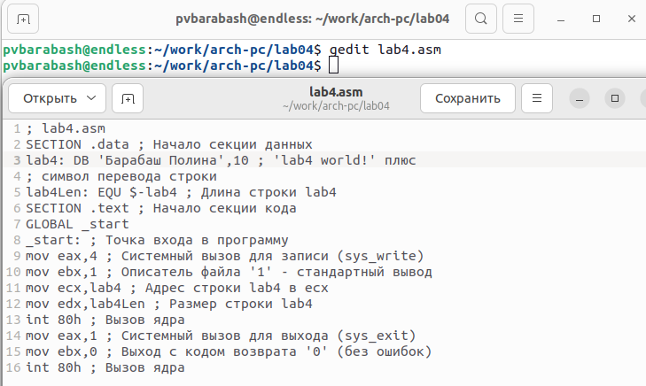

---
## Front matter
title: "Отчёт по лабораторной работе"
subtitle: "Лабораторная №4"
author: "Полина Витальевна Барабаш"

## Generic otions
lang: ru-RU
toc-title: "Содержание"

## Pdf output format
toc: true # Table of contents
toc-depth: 2
lof: true # List of figures
fontsize: 12pt
linestretch: 1.5
papersize: a4
documentclass: scrreprt
## I18n polyglossia
polyglossia-lang:
  name: russian
  options:
	- spelling=modern
	- babelshorthands=true
polyglossia-otherlangs:
  name: english
## I18n babel
babel-lang: russian
babel-otherlangs: english
## Fonts
mainfont: PT Serif
romanfont: PT Serif
sansfont: PT Sans
monofont: PT Mono
mainfontoptions: Ligatures=TeX
romanfontoptions: Ligatures=TeX
sansfontoptions: Ligatures=TeX,Scale=MatchLowercase
monofontoptions: Scale=MatchLowercase,Scale=0.9
## Biblatex
biblatex: true
biblio-style: "gost-numeric"
biblatexoptions:
  - parentracker=true
  - backend=biber
  - hyperref=auto
  - language=auto
  - autolang=other*
  - citestyle=gost-numeric
## Pandoc-crossref LaTeX customization
figureTitle: "Рис."
listingTitle: "Листинг"
lofTitle: "Список иллюстраций"
lolTitle: "Листинги"
## Misc options
indent: true
header-includes:
  - \usepackage{indentfirst}
  - \usepackage{float} # keep figures where there are in the text
  - \floatplacement{figure}{H} # keep figures where there are in the text
---

# Цель работы

Освоение процедуры компиляции и сборки программ, написанных на ассемблере NASM.

# Выполнение работы

**Задание №1.** Создать каталог для работы с программами на языке ассемблера NASM: mkdir -p ~/work/arch-pc/lab04

Я создала каталог и проверила, что он создан (рис. @fig:001).

{#fig:001 width=100%}

**Задание №2.** Перейти в созданный каталог.

Я перешла в cозданный каталог ~/work/arch-pc/lab04 с помощью  cd (рис. @fig:002).

{#fig:002 width=100%}

**Задание №3.** Создать текстовый файл с именем hello.asm. 

Я создала текстовый файл с именем hellp.asm с помощью touch и проверила его создание с помощью ls (рис. @fig:003).

{#fig:003 width=100%}

**Задание №4.** Открыть этот файл с помощью любого текстового редактора, например, gedit, и ввести в него необходимый текст.

Я открыла этот файл с помощью gedit и ввела необходимый текст (рис. @fig:004).

{#fig:004 width=100%}

**Задание №5.** Скомпилировать текст программы из файла hello.asm и проверить, что был создан объектный файл. Какое имя имеет объектный файл?

Я скомпилировала текст программы с помощью nasm -f elf hello.asm и проверила, что был создан файл **hello.o** в текущем каталоге с помощью ls (рис. @fig:005).

{#fig:005 width=100%}

**Задание №6.** Ввести команду nasm -o obj.o -f elf -g -l list.lst hello.asm, которая скомпилирует исходный файл hello.asm в obj.o (опция -o позволяет
задать имя объектного файла, в данном случае obj.o), при этом формат выходного файла будет elf, и в него будут включены символы для отладки (опция -g), кроме того, будет создан файл листинга list.lst (опция -l). Проверить, что файлы были созданы. 

Я ввела необходимую команду и проверила, что файлы list.lst и obj.o были созданы (рис. @fig:006).

{#fig:006 width=100%}

**Задание №7.** Передать объектный файл на обработку компоновщика. Проверить, что исполняемый файл hello был создан.

Я передала объектный файл с помощью команды ld -m elf_i386 hello.o -o hello и проверила, что исполняемый файл hello был создан  (рис. @fig:007).

{#fig:007 width=100%}

**Задание №8.** Выполните следующую команду: ld -m elf_i386 obj.o -o main
Какое имя будет иметь исполняемый файл? Какое имя имеет объектный файл из которого собран этот исполняемый файл?

Исходя из текста команды, на обработку компоновщика передаётся объектный файл **obj.o**, а создан будет исполняемый файл с именем **main**. 

Я выполнила предложенную команду и посмотрела, какой файл был создан, с помощью ls (рис. @fig:008).

{#fig:008 width=100%}

Действительно, исполняемый файл **main**. 

**Задание №9.** Запустить на выполнение созданный исполняемый файл, находящийся в текущем каталоге.

С помощью команды ./hello я запустила на выполнение созданный исполняемый файл hello. На экран было выведено *Hello word!* (рис. @fig:009).

{#fig:009 width=100%}

# Выполнение самостоятельной работы

**Задание №1.** В каталоге ~/work/arch-pc/lab04 с помощью команды cp создайте копию файла hello.asm с именем lab4.asm

Я создала копию файла hello.asm с именем lab4.asm, введя cp hello.asm lab4.asm и проверила, что файл lab4.asm был создан (рис. @fig:010).

{#fig:010 width=100%}

**Задание №2.** С помощью любого текстового редактора внесите изменения в текст программы в файле lab4.asm так, чтобы вместо *Hello world!* на экран выводилась строка с вашими фамилией и именем.

Я открыла файл lab4.asm с помощью gedit и изменила текст так, чтобы выводилась строка с моими фамилией и именем (рис. @fig:011).

{#fig:011 width=100%}

**Задание №3.** Оттранслировать полученный текст программы lab4.asm в объектный файл. Выполните компоновку объектного файла и запустите получившийся исполняемый файл.

С помощью nasm -f elf lab4.asm я оттранслировала полученный текст программы lab4.asm в объектный файл. С помощью ld -m elf_i386 lab4.o -o lab4 я выполнила компоновку объектного файла и с помощью ./lab4 я запустила получившийся исполняемый файл. В терминал действительно вывелись мои фамилия и имя *Барабаш Полина* (рис. @fig:012).

{#fig:012 width=100%}

**Задание №4.** Скопируйте файлы hello.asm и lab4.asm в Ваш локальный репозиторий в каталог ~/work/study/2023-2024/"Архитектура компьютера"/arch-pc/labs/lab04/. Загрузите файлы на Github.

С помощью команды cp я скопировала файлы hello.asm и lab4.asm в мой локальный репозиторий в каталог ~/work/study/2023-2024/"Архитектура компьютера"/arch-pc/labs/lab04/. И с помощью ls проверила, что оба файла скомированы в нужный каталог (рис. @fig:013).

{#fig:013 width=100%}

Перед тем, как загружать файлы на Github, я перешла в каталог ~/work/study/2023-2024/"Архитектура компьютера"/arch-pc/labs/lab04/report с помощью команды cd и с помощью команды make скомпилировала отчёт также в форматах .docx и .pdf (рис. @fig:014).

{#fig:014 width=100%}

Поднявшись на одну папку вверх, я загрузила файлы на Github с помощью последовательного ввода следующих команд:

git add .

git commit -am 'feat(main): add files lab-4, lab4.asm, hello.asm'

git push

{#fig:015 width=100%}

{#fig:016 width=100%}

# Выводы
Я освоила процедуры компиляции и сборки программ, написанных на ассемблере NASM. Познакомилась со структурой программы на языке NASM. Вспомнила синтаксис команды cp, как выгружать файлы в Github. 

