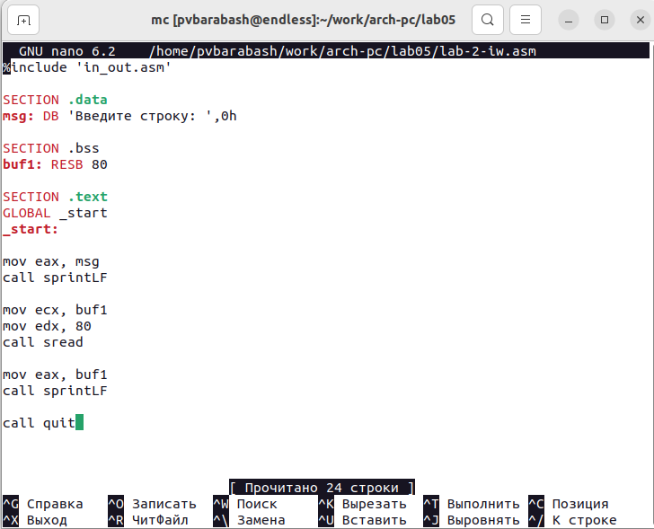

---
## Front matter
title: "Отчёт по лабораторной работе"
subtitle: "Лабораторная №5"
author: "Полина Витальевна Барабаш"

## Generic otions
lang: ru-RU
toc-title: "Содержание"

## Pdf output format
toc: true # Table of contents
toc-depth: 2
lof: true # List of figures
fontsize: 12pt
linestretch: 1.5
papersize: a4
documentclass: scrreprt
## I18n polyglossia
polyglossia-lang:
  name: russian
  options:
	- spelling=modern
	- babelshorthands=true
polyglossia-otherlangs:
  name: english
## I18n babel
babel-lang: russian
babel-otherlangs: english
## Fonts
mainfont: PT Serif
romanfont: PT Serif
sansfont: PT Sans
monofont: PT Mono
mainfontoptions: Ligatures=TeX
romanfontoptions: Ligatures=TeX
sansfontoptions: Ligatures=TeX,Scale=MatchLowercase
monofontoptions: Scale=MatchLowercase,Scale=0.9
## Biblatex
biblatex: true
biblio-style: "gost-numeric"
biblatexoptions:
  - parentracker=true
  - backend=biber
  - hyperref=auto
  - language=auto
  - autolang=other*
  - citestyle=gost-numeric
## Pandoc-crossref LaTeX customization
figureTitle: "Рис."
listingTitle: "Листинг"
lofTitle: "Список иллюстраций"
lolTitle: "Листинги"
## Misc options
indent: true
header-includes:
  - \usepackage{indentfirst}
  - \usepackage{float} # keep figures where there are in the text
  - \floatplacement{figure}{H} # keep figures where there are in the text
---

# Цель работы

Приобретение практических навыков работы в Midnight Commander. Освоение инструкций языка ассемблера mov и int.

# Выполнение работы

**Задание №1.** Откройте Midnight Commander

Я открыла Midnight Commander с помощью команды mc (рис. @fig:001).

{#fig:001 width=100%}

**Задание №2.** Пользуясь стрелочками и клавишей Enter перейдите в каталог ~/work/arch-pc созданный при выполнении лабораторной работы №4

Я перешла в cозданный каталог ~/work/arch-pc, используя управение (рис. @fig:002).

{#fig:002 width=100%}

**Задание №3.** С помощью функциональной клавиши F7 создайте папку lab05 и перейдите в созданный каталог.

Я создала папку с именем lab05 с помощью функциональной клавиши F7 и перешла в созданный каталог(рис. @fig:003).

{#fig:003 width=100%}

**Задание №4.** Пользуясь строкой ввода и командой touch создайте файл lab5-1.asm.

Я создала файл lab5-1.asm с помощью команды touch, которую ввела в строку ввода терминала(рис. @fig:004).

{#fig:004 width=100%}

**Задание №5.** С помощью функциональной клавиши F4 откройте файл lab5-1.asm для редактирования во встроенном редакторе. 

С помощью функциональной клавиши F4 я открыла файл lab5-1.asm в редакторе nano, который выбрала из списка предложенных встроенных редакторов (рис. @fig:005).

{#fig:005 width=100%}

**Задание №6.** Введите текст программы из листинга 5.1 (можно без комментариев), сохраните изменения и закройте файл. 

Я ввела необходимый текст программы из листинга без комментариев и сохранила изменения с помощью приведённой последовательности действий: Ctrl + x (выход) > Y (сохранить изменения) > Enter (рис. @fig:006).

{#fig:006 width=100%}

**Задание №7.** С помощью функциональной клавиши F3 откройте файл lab5-1.asm для просмотра. Убедитесь, что файл содержит текст программы.

С помощью функциональной клавиши F3 я открыла файл lab5-1.asm для просмотра и убедилась, что файл содержит текст программы (рис. @fig:007).

{#fig:007 width=100%}

**Задание №8.** Оттранслируйте текст программы lab5-1.asm в объектный файл. Выполните компоновку объектного файла и запустите получившийся исполняемый файл. Программа выводит строку 'Введите строку:' и ожидает ввода с клавиатуры. На запрос введите Ваши ФИО.

Я оттранслировала файл lab5-1.asm в объектный файл с помощью nasm -f elf lab5-1.asm, выполнила компанувку объектного файла (ld -m elf_i386 -o lab5-1 lab5-1.o) и запустила получившийся исполняемый файл (./lab5-1). В терминале появилась строка "Введите строку:". Я ввела своё ФИО: Барабаш Полина Витальевна (рис. @fig:008).

{#fig:008 width=100%}

**Задание №9.** В одной из панелей mc откройте каталог с файлом lab5-1.asm. В другой панели каталог со скаченным файлом in_out.asm (для перемещения между панелями используйте Tab). Скопируйте файл in_out.asm в каталог с файлом lab5-1.asm.

Открыв в одной панеле каталог с файлом lab5-1.asm, а в другой каталог "Загрузки" со скаченным файлом in_out.asm, я переместила in_out.asm с помощью функциональной клавиши F6 (так как она отвечает за перемещение) (рис. @fig:009).

{#fig:009 width=100%}

**Задание №10.** С помощью функциональной клавиши создайте копию файла lab5-1.asm с именем lab5-2.asm.

С помощью функциональной клавиши F5 (так как она отвечает за копирование) я создала копию файла lab5-1.asm с именем lab5-2.asm (рис. @fig:010).

{#fig:010 width=100%}

**Задание №11.** Исправьте текст программы в файле lab5-2.asm с использование подпрограмм из внешнего файла in_out.asm (используйте подпрограммы sprintLF, sread и quit) в соответствии с листингом 5.2. Создайте исполняемый файл и проверьте его работу.

Я исправила текст программы в lab5-2.asm с использование подпрограмм из внешнего файла in_out.asm (использовала подпрограммы sprintLF, sread и quit) в соответствии с листингом 5.2. (рис. @fig:011). 

{#fig:011 width=100%}

Я создала исполняемый файл и проверила его работу (рис. @fig:012).

{#fig:012 width=100%}

**Задание № 12.** В файле lab5-2.asm замените подпрограмму sprintLF на sprint. Создайте исполняемый файл и проверьте его работу. В чем разница?

Я заменила подпрограмму sprintLF на sprint. Создала исполняемый файл и проверила его работу (рис. @fig:013).

{#fig:013 width=100%}

Отличием является то, что при подпрограмме sprintLF после вопроса идёт перенос строки, а при подпрограмме sprint ответ вводится на той же строке.

# Выполнение самостоятельной работы

**Задание №1.** Создайте копию файла lab5-1.asm. Внесите изменения в программу (без использования внешнего файла in_out.asm), так чтобы она работала по следующему алгоритму:

• вывести приглашение типа “Введите строку:”;

• ввести строку с клавиатуры;

• вывести введённую строку на экран.

С помощью функциональной клавиши F5 я создала копию файла lab5-1.asm с именем lab5-1-iw.asm и добавила в неё часть кода, чтобы программа выводила строку, введённую с клавиатуры. Текст кода, жирным выделен добавленный фрагмент:

SECTION .data

msg: DB 'Введите строку:',10 

msgLen: EQU $-msg

SECTION .bss

buf1: RESB 80

SECTION .text

GLOBAL _start

_start:

mov eax,4

mov ebx,1

mov ecx,msg

mov edx,msgLen

int 80h

mov eax, 3

mov ebx, 0

mov ecx, buf1

mov edx, 80

int 80h

**mov eax,4**

**mov ebx,1**

**mov ecx,buf1**

**mov edx,80**

**int 80h**

mov eax,1

mov ebx,0

int 80h

(рис. @fig:014).

{#fig:014 width=100%}

**Задание №2.** Получите исполняемый файл и проверьте его работу. На приглашение ввести строку введите свою фамилию.

Я получила исполняемый файл и проверила его работу. На приглашение ввести строку я ввела свою фамилию и программа вывела её обратно (рис. @fig:015).

{#fig:015 width=100%}

**Задание №3.** Создайте копию файла lab5-2.asm. Исправьте текст программы с использование подпрограмм из внешнего файла in_out.asm, так чтобы она работала по следующему алгоритму:

• вывести приглашение типа “Введите строку:”;

• ввести строку с клавиатуры;

• вывести введённую строку на экран.

С помощью функциональной клавиши F5 я создала копию файла lab5-2.asm с именем lab5-2-iw.asm и исправила текст программы, добавив подпрограмму sprintLF для вывода введённой строки (на новой строке). Текст кода, жирным выделен добавленный фрагмент кода:

%include 'in_out.asm'

SECTION .data

msg: DB 'Введите строку: ',0h

SECTION .bss

buf1: RESB 80

SECTION .text

GLOBAL _start

_start:

mov eax, msg

call sprintLF

mov ecx, buf1

mov edx, 80

call sread

**mov eax, buf1**

**call sprintLF**

call quit 

(рис. @fig:016).

{#fig:016 width=100%}

**Задание №4.** Создайте исполняемый файл и проверьте его работу.

Я создала исполняемый файл и проверила его работу. На приглашение ввести строку я ввела свою фамилию и программа вывела её обратно (рис. @fig:017).

{#fig:017 width=100%}

# Выводы
Я приобрела практические навыки работы в Midnight Commander. Научилась открывать Midnight Commander, передвигаться внутри него, используя стрелочки, клавиши Enter и Tab. Взаимодействовать с помощью функциональных клавиш: открывать для редактирования и для просмотра файлы, создавать каталоги, копировать и перемещать файлы. Я освоила инструкции языка ассемблера mov и int. Узнала как выводить строки, как считывать введенные строки, как завершать программы. Узнала, как подключать подпрограммы из внешнего файла. 
