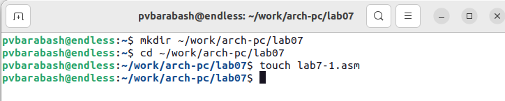
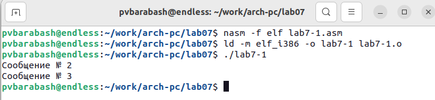
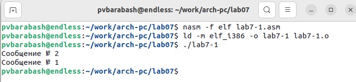
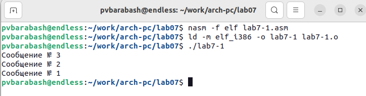
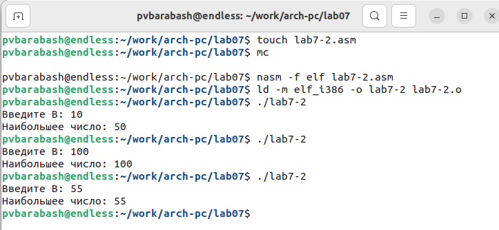
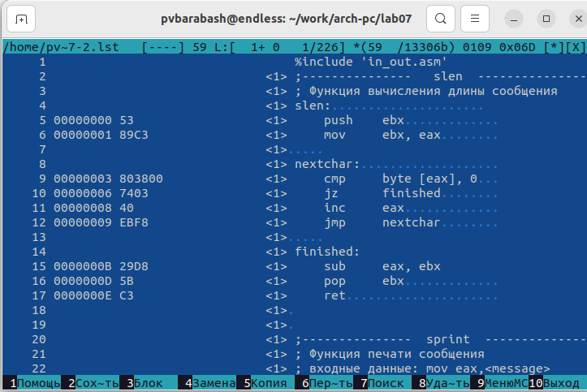
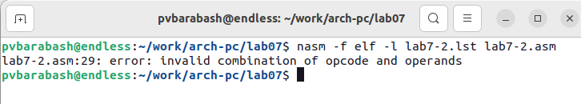
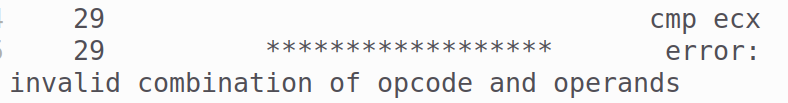
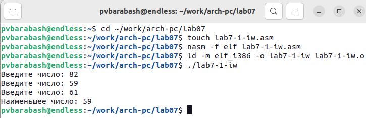
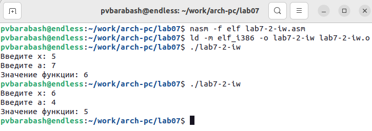

---
## Front matter
title: "Отчёт по лабораторной работе"
subtitle: "Лабораторная №7"
author: "Полина Витальевна Барабаш"

## Generic otions
lang: ru-RU
toc-title: "Содержание"

## Pdf output format
toc: true # Table of contents
toc-depth: 2
lof: true # List of figures
fontsize: 12pt
linestretch: 1.5
papersize: a4
documentclass: scrreprt
## I18n polyglossia
polyglossia-lang:
  name: russian
  options:
	- spelling=modern
	- babelshorthands=true
polyglossia-otherlangs:
  name: english
## I18n babel
babel-lang: russian
babel-otherlangs: english
## Fonts
mainfont: PT Serif
romanfont: PT Serif
sansfont: PT Sans
monofont: PT Mono
mainfontoptions: Ligatures=TeX
romanfontoptions: Ligatures=TeX
sansfontoptions: Ligatures=TeX,Scale=MatchLowercase
monofontoptions: Scale=MatchLowercase,Scale=0.9
## Biblatex
biblatex: true
biblio-style: "gost-numeric"
biblatexoptions:
  - parentracker=true
  - backend=biber
  - hyperref=auto
  - language=auto
  - autolang=other*
  - citestyle=gost-numeric
## Pandoc-crossref LaTeX customization
figureTitle: "Рис."
listingTitle: "Листинг"
lofTitle: "Список иллюстраций"
lolTitle: "Листинги"
## Misc options
indent: true
header-includes:
  - \usepackage{indentfirst}
  - \usepackage{float} # keep figures where there are in the text
  - \floatplacement{figure}{H} # keep figures where there are in the text
---

# Цель работы

Изучение команд условного и безусловного переходов. Приобретение навыков написания программ с использованием переходов. Знакомство с назначением и структурой файла листинга.

# Выполнение работы

**Задание №1.** Создайте каталог для программам лабораторной работы № 7, перейдите в него и создайте файл lab7-1.asm

Я создала каталог для программ лабораторной работы № 7 с помощью команды mkdir ~/work/arch-pc/lab07. Затем я перешла в него с помощью команды cd и создала файл lab7-1.asm с помощью touch (рис. @fig:001).

{#fig:001 width=100%}

**Задание №2.** Рассмотрите пример программы с использованием инструкции jmp. Введите в файл lab7-1.asm текст программы из листинга 7.1. Создайте исполняемый файл и запустите его.

Рассмотрев пример программы с использованием инструкции jmp (которая в NASM используется для реализации безусловных переходов), я ввела в файл lab7-1.asm текст программы из листинга 7.1. Затем я создала исполняемый файл и запустила его (рис. @fig:002).

{#fig:002 width=100%}

Результат работы программы такой же, как в руководстве по выполнению лабораторной работы.

**Задание №3.** Изменить текст программы в соответствии с листингом 7.2, чтобы после вывода "Сообщение № 2" выводилось "Сообщение № 1", а затем программа завершалась. Создайте исполняемый файл и проверьте его работу.

Я изменила текст программы в соответствии с листингом 7.2. Я создала исполняемый файл и проверила его работу (рис. @fig:003).

{#fig:003 width=100%}

Программа работает так, как ожидалось. Сначала выводит "Сообщение № 2", а затем "Сообщение № 1" и завершает программу.

**Задание №4.** Измените текст программы добавив или изменив инструкции jmp, чтобы сначала выводилось "Сообщение № 3", затем "Сообщение № 2", затем "Сообщение № 1".

Я изменила файл lab7-1.asm, изменив после _start: "jmp _label2" на "jmp _label3" и добавив инструкцию "jmp _label2" после выполнения _label3. Создала исполняемый файл и запустила его. Программа выдает необходимый результат (рис. @fig:004).

{#fig:004 width=100%}

**Задание №5.** Создайте файл lab7-2.asm в каталоге ~/work/arch-pc/lab07. Внимательно изучите текст программы из листинга 7.3 и введите в lab7-2.asm. Создайте исполняемый файл и проверьте его работу для разных значений B.

Я создала файл lab7-2.asm в каталоге ~/work/arch-pc/lab07 с помощью touch. Внимательно изучила текст программы из листинга 7.3 и ввела в lab7-2.asm. Я создала исполняемый файл и проверила его работу для разных значений В: 10, 100 и 55. Программа работает верно (рис. @fig:005).

{#fig:005 width=100%}

**Задание №6.** Создайте файл листинга для программы из файла lab7-2.asm. Откройте файл листинга lab7-2.lst с помощью любого текстового редактора, например mcedit. Внимательно ознакомиться с его форматом и содержимым. Подробно объяснить содержимое трёх строк файла листинга по выбору. 

Я создала файл листинга с помощью команды nasm -f elf -l lab7-2.lst lab7-2.asm. Затем я открыла файл листинга в помощью команды mcedit lab7-2.lst (рис. @fig:006).

{#fig:006 width=100%}

Я внимательно ознакомилась с его форматом и содержимым. Я буду объяснять следующие строки:

    18 000000F2 B9[0A000000]            mov ecx,B
    
    19 000000F7 BA0A000000              mov edx,10
    
    20 000000FC E842FFFFFF              call sread
    
Этот кусок программы считывает введённое с клавиатуры число, записывает его в B. В правой части написаны сами строки кода. Левая часть состоит из номера строки, адреса и машинного кода. Адрес (000000F2, 000000F7, 000000FC) это смещение машинного кода от начала текущего сегмента. Начало текущего сегмента -- начало программы, начиная с section .data. Машинный код это ассемблированная исходная строка в виде шестнадцатеричной последовательности. 

То есть инструкция mov ecx,B начинается по смещению 000000F2 в сегменте кода; далее идёт машинный код, в который ассемблируется инструкция, то есть инструкция mov ecx,B ассемблируется в  B9[0A000000], где B9 является mov ecx, то есть запись в ecx, а [0A000000] ссылает на В (то, что переносится в ecx).

Инструкция mov edx,10 начинается по смещению 000000F7 в сегменте кода; далее идёт машинный код BA0A000000, в который ассемблируется инструкция mov edx,10. Здесь BA является mov edx, то есть запись в edx, а 0A000000 указывает на 10, то есть на максимальную длину выводимой строки. 

Инструкция call sread начинается по смещению 000000FC в сегменте кода; далее идёт машинный код E842FFFFFF, в который ассемблируется инструкция call sread.

**Задание №7.** Откройте файл с программой lab7-2.asm и в любой инструкции с двумя операндами удалить один операнд. Выполните трансляцию с получением файла листинга. Какие выходные файлы создаются в этом случае? Что добавляется в листинге?

Я открыла файл с программой lab7-2.asm и в инструкции cmp ecx,[C] удалила операнд [C]. Я выполнила трансляцию с получением файла листинга. В результате было выдано сообщение об ошибке (рис. @fig:007).

{#fig:007 width=100%}

Файл листинга создаётся. На месте ошибочной инструкции также сообщается об ошибке (рис. @fig:008).

{#fig:008 width=100%}

# Выполнение самостоятельной работы

**Задание №1.** Напишите программу нахождения наименьшей из 3 целочисленных переменных a, b и c. Значения переменных выбрать из табл. 7.5 в соответствии с вариантом, полученным при выполнении лабораторной работы № 6. Создайте исполняемый файл и проверьте его работу.

В прошлой лабораторной работе был получен второй вариант. Следовательно, значения переменных 82, 59, 61. Я создала файл lab7-1-iw.asm и написала программу для нахождения наименьшей из 3 целочисленных переменных. Программа работает верно (рис. @fig:009).

{#fig:009 width=100%}

**Задание №2.** Напишите программу, которая для введенных с клавиатуры значений x и a вычисляет значение заданной функции f(x) и выводит результат вычислений. Вид функции f(x) выбрать из таблицы 7.6 вариантов заданий в соответствии с вариантом, полученным при выполнении лабораторной работы № 6. Создайте исполняемый файл и проверьте его работу для значений x и a из 7.6.

Я создала файл lab7-2-iw.asm и написала программу для нахождения значения функции, данной во втором варианте. Если x < a, f(x) = a - 1. Если a > = x, то f(x) = x-1. Я проверила работу функции с данными значениями x и a. Программа работает верно (рис. @fig:010).

{#fig:010 width=100%}

# Выводы

Я изучила команды условного и безусловного переходов, приобрела навыки написания программ с использованием переходов. Также я познакомилась с назначением и структурой файла листинга.
