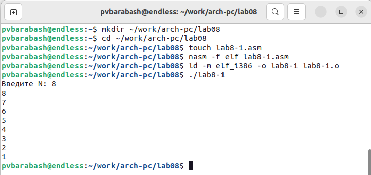
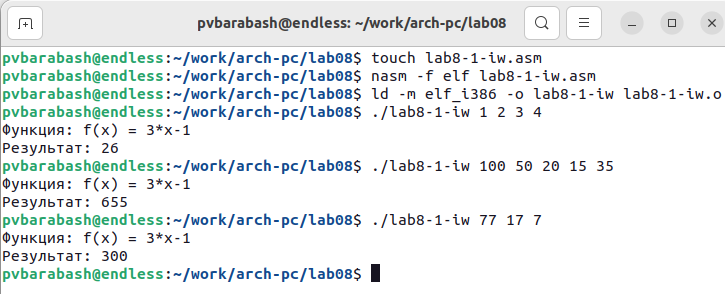

---
## Front matter
title: "Отчёт по лабораторной работе"
subtitle: "Лабораторная №8"
author: "Полина Витальевна Барабаш"

## Generic otions
lang: ru-RU
toc-title: "Содержание"

## Pdf output format
toc: true # Table of contents
toc-depth: 2
lof: true # List of figures
fontsize: 12pt
linestretch: 1.5
papersize: a4
documentclass: scrreprt
## I18n polyglossia
polyglossia-lang:
  name: russian
  options:
	- spelling=modern
	- babelshorthands=true
polyglossia-otherlangs:
  name: english
## I18n babel
babel-lang: russian
babel-otherlangs: english
## Fonts
mainfont: PT Serif
romanfont: PT Serif
sansfont: PT Sans
monofont: PT Mono
mainfontoptions: Ligatures=TeX
romanfontoptions: Ligatures=TeX
sansfontoptions: Ligatures=TeX,Scale=MatchLowercase
monofontoptions: Scale=MatchLowercase,Scale=0.9
## Biblatex
biblatex: true
biblio-style: "gost-numeric"
biblatexoptions:
  - parentracker=true
  - backend=biber
  - hyperref=auto
  - language=auto
  - autolang=other*
  - citestyle=gost-numeric
## Pandoc-crossref LaTeX customization
figureTitle: "Рис."
listingTitle: "Листинг"
lofTitle: "Список иллюстраций"
lolTitle: "Листинги"
## Misc options
indent: true
header-includes:
  - \usepackage{indentfirst}
  - \usepackage{float} # keep figures where there are in the text
  - \floatplacement{figure}{H} # keep figures where there are in the text
---

# Цель работы

Приобретение навыков написания программ с использованием циклов и обработкой аргументов командной строки.

# Выполнение работы

**Задание №1.** Создайте каталог для программам лабораторной работы № 8, перейдите в него и создайте
файл lab8-1.asm. Внимательно изучите текст программы (Листинг 8.1). Введите в файл lab8-1.asm текст программы из листинга 8.1. Создайте исполняемый файл и проверьте его работу. 

Я создала каталог для программ лабораторной работы № 8 с помощью команды mkdir ~/work/arch-pc/lab08. Затем я перешла в него с помощью команды cd и создала файл lab8-1.asm с помощью touch. Я внимательно изучила текст программы и ввела его в созданный файл. После этого создала исполняемый файл и проверила его работу (рис. @fig:001).

{#fig:001 width=100%}

В теле цикла при каждом заходе печатается значение ecx, то есть изначальное N и результаты последовательного вычитания единицы, которое происходит в loop. Программа работает корректно.

**Задание №2.** Измените текст программы, добавив изменение значение регистра ecx в цикле. Создайте исполняемый файл и проверьте его работу. Какие значения принимает регистр ecx в цикле? Соответствует ли число проходов цикла значению N введенному с клавиатуры?

Я изменила текст программы, добавив вычитание из ecx в цикле единицы. Создала исполняемый файл и проверила его работу (рис. @fig:002).

{#fig:002 width=100%}

Регистр ecx в цикле принимает значения 7, 5, 3, 1. Число проходов не соответствует значению N, введенному с клавиатуры (8).  

**Задание №3.** Внесите изменения в текст программы, добавив команды push и pop (добавления в стек и извлечения из стека) для сохранения значения счетчика цикла loop. Создайте исполняемый файл и проверьте его работу. Соответствует ли в данном случае число проходов цикла значению N, введенному с клавиатуры?

Я изменила текст программы, добавив команды push и pop для сохранения значения счетчика цикла loop. Я создала исполняемый файл и проверила его работу (рис. @fig:003).

{#fig:003 width=100%}

В данном случае число проходов цикла соответствует введенному значению N.

**Задание №4.** Внимательно изучите текст программы (Листинг 8.2). Создайте файл lab8-2.asm в каталоге ~/work/arch-pc/lab08 и введите в него текст программы из листинга 8.2. Создайте исполняемый файл и запустите его, указав аргументы: 

user@dk4n31:~$ ./lab8-2 аргумент1 аргумент 2 'аргумент 3'

Сколько аргументов было обработано программой?

Я внимательно изучила текст программы. Создала файл lab8-2.asm и ввела в него текст программы. Затем создала исполняемый файл и запустила его (рис. @fig:004).

{#fig:004 width=100%}

Программой было обработано 4 аргумента, что является ошибкой, ведь аргументов всего 3. Так происходит потому, что "аргумент 2" не задан как единое целое и пробел воспринимается, как разделитель. 

**Задание №5.** Рассмотрите еще один пример программы, которая выводит сумму чисел, которые передаются в программу как аргументы. Создайте файл lab8-3.asm в каталоге ~/work/arch-pc/lab08 и введите в него текст программы из листинга 8.3. Создайте исполняемый файл и запустите его, указав аргументы.

Я внимательно изучила программу, создала файл lab8-3.asm в каталоге ~/work/arch-pc/lab08 с помощью touch. После того, как я ввела текст программы в файл, я создала исполняемый файл и проверила его работу на данном в руководстве примере. Программа работает верно (рис. @fig:005).

{#fig:005 width=100%}

**Задание №6.** Измените текст программы из листинга 8.3 для вычисления произведения аргументов командной строки. 

Я изменила текст программы для вычисления произведения аргументов командной строки. Создала исполняемый файл и проверила его работу (рис. @fig:006).

{#fig:006 width=100%}

Проверив вручную, я убедилась, что программа работает верно. Изменённый код Вы найдете в прикреплённом файле lab8-3.asm.

# Выполнение самостоятельной работы

**Задание №1.** Напишите программу, которая находит сумму значений функции f(x) для x = x1, x2, ..., xn, т.е. программа должна выводить значение f(x1) + f(x2) + ... + f(xn). Значения xi передаются как аргументы. Вид функции f(x) выбрать из таблицы 8.1 вариантов заданий в соответствии с вариантом, полученным при выполнении лабораторной работы № 7. Создайте исполняемый файл и проверьте его работу на нескольких наборах x = x1, x2, ..., xn.

Мой вариант второй. Следовательно мне необходимо написать программу вычисления функции 3*x-1.
Я создала файл lab8-1-iw.asm и написала в нём программу. Я создала исполняемый файл и проверила работу программы на трёх наборах (рис. @fig:007).

{#fig:007 width=100%}

Проверим вычисления вручную.

3 * 1 - 1 = 2; 3 * 2 - 1 = 5; 3 * 3 - 1 = 8; 3 * 4 - 1 = 11; 2 + 5 + 8 + 11 = 26 (ответ верный)

3 * 100 - 1 = 299; 3 * 50 - 1 = 149; 3 * 20 - 1 = 59; 3 * 15 - 1 = 44; 3 * 35 - 1 = 104; 299 + 149 + 59 + 44 + 104 = 655 (ответ верный)

3 * 77 - 1 = 230; 3 * 17 - 1 = 50; 3 * 7 - 1 = 20; 230 + 50 + 20 = 300 (ответ верный)

# Выводы

Я приобретела навыки написания программ с использованием циклов и обработки аргументов командной строки. Узнала, как работают push и pop.
