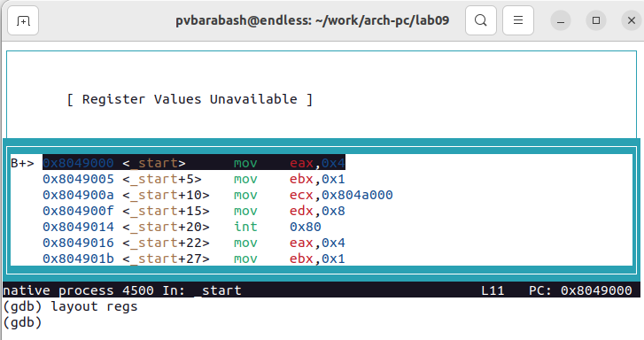
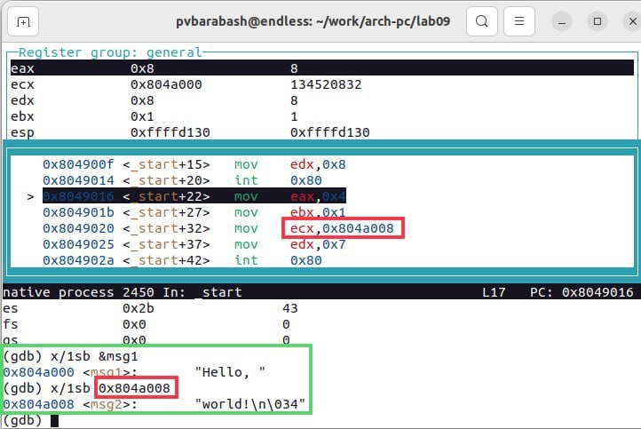
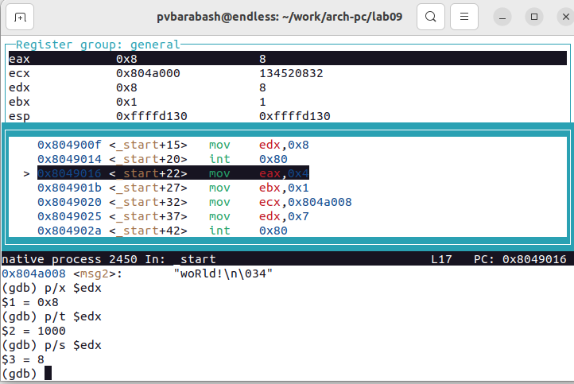

---
## Front matter
title: "Отчёт по лабораторной работе"
subtitle: "Лабораторная №9"
author: "Полина Витальевна Барабаш"

## Generic otions
lang: ru-RU
toc-title: "Содержание"

## Pdf output format
toc: true # Table of contents
toc-depth: 2
lof: true # List of figures
fontsize: 12pt
linestretch: 1.5
papersize: a4
documentclass: scrreprt
## I18n polyglossia
polyglossia-lang:
  name: russian
  options:
	- spelling=modern
	- babelshorthands=true
polyglossia-otherlangs:
  name: english
## I18n babel
babel-lang: russian
babel-otherlangs: english
## Fonts
mainfont: PT Serif
romanfont: PT Serif
sansfont: PT Sans
monofont: PT Mono
mainfontoptions: Ligatures=TeX
romanfontoptions: Ligatures=TeX
sansfontoptions: Ligatures=TeX,Scale=MatchLowercase
monofontoptions: Scale=MatchLowercase,Scale=0.9
## Biblatex
biblatex: true
biblio-style: "gost-numeric"
biblatexoptions:
  - parentracker=true
  - backend=biber
  - hyperref=auto
  - language=auto
  - autolang=other*
  - citestyle=gost-numeric
## Pandoc-crossref LaTeX customization
figureTitle: "Рис."
listingTitle: "Листинг"
lofTitle: "Список иллюстраций"
lolTitle: "Листинги"
## Misc options
indent: true
header-includes:
  - \usepackage{indentfirst}
  - \usepackage{float} # keep figures where there are in the text
  - \floatplacement{figure}{H} # keep figures where there are in the text
---

# Цель работы

Приобретение навыков написания программ с использованием подпрограмм. Знакомство с методами отладки при помощи GDB и его основными возможностями.

# Выполнение работы

**Задание №1.** Создайте каталог для выполнения лабораторной работы № 9, перейдите в него и создайте файл lab09-1.asm. 

Я создала каталог для программ лабораторной работы № 9 с помощью команды mkdir ~/work/arch-pc/lab09. Затем я перешла в него с помощью команды cd и создала файл lab09-1.asm с помощью touch (рис. @fig:001).

{#fig:001 width=100%}

**Задание №2.** Внимательно изучите текст программы (Листинг 9.1). Введите в файл lab09-1.asm текст программы из листинга 9.1. Создайте исполняемый файл и проверьте его работу.

Я внимательно изучила текст программы и ввела его в созданный файл. После этого создала исполняемый файл и проверила его работу (рис. @fig:002).

{#fig:002 width=100%}

Программа работает корректно. 

**Задание №3.** Измените текст программы, добавив подпрограмму _subcalcul в подпрограмму _calcul, для вычисления выражения f(g(x)), где x вводится с клавиатуры, f(x) = 2x + 7, g(x) = 3x − 1. Т.е. x передается в подпрограмму _calcul из нее в подпрограмму _subcalcul, где вычисляется выражение g(x), результат возвращается в _calcul и вычисляется выражение f(g(x)). Результат возвращается в основную программу для вывода результата на экран.

Я изменила текст программы, добавив подпрограмму _subcalcul. Я создала исполняемый файл и проверила его работу (рис. @fig:003).

{#fig:003 width=100%}

Проверим вручную, какой результат должен был получится при x = 6. 3*6-1=17, 2*17+7=41. Такой результат выдала и программа. 

**Задание №4.** Создайте файл lab09-2.asm с текстом программы из Листинга 9.2. Получите исполняемый файл. Для работы с GDB в исполняемый файл необходимо добавить отладочную информацию, для этого трансляцию программ необходимо проводить с ключом ‘-g’.
Загрузите исполняемый файл в отладчик gdb. Проверьте работу программы, запустив ее в оболочке GDB с помощью команды run (сокращённо r). 

Я создала файл lab09-2.asm и ввела в него текст программы листинга 9.2. Затем создала исполняемый файл, добавив ключом ‘-g’ при трансляции и запустила его в оболочке GDB с помощью команды run (рис. @fig:004).

{#fig:004 width=100%}

Программа работает и выводит Hello, world!.

**Задание №5.** Для более подробного анализа программы установите брейкпоинт на метку _start, с которой начинается выполнение любой ассемблерной программы, и запустите её. Посмотрите дисассимилированный код программы с помощью команды disassemble начиная с метки _start. Переключитесь на отображение команд с Intel’овским синтаксисом, введя команду set disassembly-flavor intel. Перечислите различия отображения синтаксиса машинных команд в режимах ATT и Intel. Включите режим псевдографики для более удобного анализа программы.

Я установила брейкпоинт на метку _start с помощью break _start и запустила программу с помощью run. После этого я посмотрела дисассимилированный код программы с помощью команды disassemble начиная с метки _start. Данные действия отображены на (рис. @fig:005).

{#fig:005 width=100%}

Я переключилась на отображение команд с Intel'овским синтаксисом, введя команду set disassembly-flavor intel. Посмотрела дисассимилированный код программы с помощью disassemble начиная с метки _start (рис. @fig:006).

{#fig:006 width=100%}

Сравнивая два дисассимилированных кода, мы видим, что левые части одинаковы, а вот правые отличаются. Intel'овский вид нам привычнее, при команде mov мы видим сначала знакомые нам регистры eax, ebx, ecx и т.д., а затем идут адреса перемещаемых переменных. Вид ATT сначала даёт адреса, а потом регистры. 

Я включила режим псевдографики для более удобного анализа программы с помощью последовательного ввода команд layout asm и layout regs, действительно содержится три окна, как написано в руководстве (рис. @fig:007).

{#fig:007 width=100%}

**Задание №6.** На предыдущих шагах была установлена точка останова по имени метки (_start). Проверьте это с помощью команды info breakpoints. Определите адрес предпоследней инструкции (mov ebx,0x0) и установите точку останова. Посмотрите информацию о всех установленных точках останова.

С помощью команды info breakpoints я проверила, что точка останова поставлена на _start (рис. @fig:008).

{#fig:008 width=100%}

Затем я установила точку останова на предпоследнюю инструкцию по её адресу и проверила с помощью i b, что она установлена (рис. @fig:009).

{#fig:009 width=100%}

**Задание №7.** Выполните 5 инструкций с помощью команды stepi (или si) и проследите за изменением значений регистров. Посмотрите значение переменной msg1 по имени. Посмотрите значение переменной msg2 по адресу. Измените первый символ переменной msg1. Замените любой символ во второй переменной msg2. Выведете в различных форматах (в шестнадцатеричном формате, в двоичном формате и в символьном виде) значение регистра edx. С помощью команды set измените значение регистра ebx сначала на '2', а затем на 2. Объясните разницу вывода команд p/s $ebx. Завершите выполнение программы с помощью команды continue (сокращенно c) или stepi (сокращенно si) и выйдите из GDB с помощью команды quit (сокращенно q).

Я выполнила 5 инструкций с помощью команды si, добавив к si аргумент 5. Были изменены регистры eax, ebx, ecx и edx (рис. @fig:010).

{#fig:010 width=100%}

Я посмотрела значение переменной msg1 по имени и значение переменной msg2 по адресу с помощью x/1sb (рис. @fig:011).

{#fig:011 width=100%}

Я измените первый символ переменной msg1 с 'H' на 'h'. Затем я заменила 4-ый символ во второй переменной msg2 с 'r' на 'R' (рис. @fig:012).

{#fig:012 width=100%}

Я вывела в различных форматах (в шестнадцатеричном формате, в двоичном формате и в символьном виде) значение регистра edx (рис. @fig:013).

{#fig:013 width=100%}

С помощью команды set я изменила значение регистра ebx сначала на '2', а затем на 2. Разница вывода возникает, потому что для '2' выводится код символа, а для 2 просто 2 (рис. @fig:014).

{#fig:014 width=100%}

Я завершила выполнение программы с помощью команды continue и вышла из GDB с помощью команды quit (рис. @fig:015).

{#fig:015 width=100%}

**Задание №8.** Скопируйте файл lab8-2.asm, созданный при выполнении лабораторной работы №8, с программой выводящей на экран аргументы командной строки (Листинг 8.2) в файл с именем lab09-3.asm. Создайте исполняемый файл. Загрузите исполняемый файл в отладчик, указав аргументы. Установите точку останова перед первой инструкцией в программе и запустите ее. Адрес вершины стека хранится в регистре esp и по этому адресу располагается число равное количеству аргументов командной строки (включая имя программы), число аргументов равно 5 – это имя программы lab09-3 и непосредственно аргументы: аргумент1, аргумент, 2 и 'аргумент 3'. Посмотрите остальные позиции стека. Объясните, почему шаг изменения адреса равен 4.

Я копировала файл lab8-2.asm в lab09 с именем lab09-3.asm. Затем создала исполняемый файл и загрузила исполняемый файл в отладчик, указав аргументы, добавив --args (рис. @fig:016).

{#fig:016 width=100%}

Я установила точку останова перед первой инструкцией в программе и запустила ее (рис. @fig:017).

{#fig:017 width=100%}

Я повторила команду x/x $esp, чтобы посмотреть количество аргументов. Затем я посмотрела остальные позиции стека (рис. @fig:018).

{#fig:018 width=100%}

Шаг равен 4, так как размер регистра равен 4 байтам.

# Выполнение самостоятельной работы

**Задание №1.** Преобразуйте программу из лабораторной работы №8 (Задание №1 для самостоятельной работы), реализовав вычисление значения функции f(x) как подпрограмму.

Нужно написать программу, которая находит сумму значений функции f(x) для x = x1, x2, …, xn, т.е. программа должна выводить значение f(x1) + f(x2) + … + f(xn), где в подпрограмму вынести вычисление f(x) в подпрограмму. Значения xi передаются как аргументы. Мой вариант второй. Следовательно мне необходимо написать подпрограмму вычисления функции 3*x-1.

Я скопировала файл lab8-1-iw.asm с названием lab09-1-iw.asm и преобразовала в нём программу. Я создала исполняемый файл и проверила работу программы на трёх наборах из предыдущей лабораторной, где проверила результаты вручную. Ответы совпадают, программа работает верно (рис. @fig:019).

{#fig:019 width=100%}

**Задание №2.** В листинге 9.3 приведена программа вычисления выражения (3 + 2) * 4 + 5. При запуске данная программа дает неверный результат. Проверьте это. С помощью отладчика GDB, анализируя изменения значений регистров, определите ошибку и исправьте ее.

Значение выражения равно 25 (5*4 = 20, 20+5 = 25).

Я создала файл lab09-2-iw.asm и скопировала в него текст программы. Затем создала исполняемый файл и запустила его. Результат, выдаваемый программой, равен 10, он ошибочен (рис. @fig:020).

{#fig:020 width=100%}

Я открыла программу в GDB (рис. @fig:021).

{#fig:021 width=100%}

Запустила её, поставила точку останова на _start, затем переключилась на отображение команд с Intel'овским синтаксисом и посмотрела дисассимилированный код программы (рис. @fig:022).

{#fig:022 width=100%}

Затем я включила режим псевдографики (рис. @fig:023).

{#fig:023 width=100%}

И начала последовательно идти по программе с помощью команды si и отслеживать изменение значений регистров. Я увидела, что инструкция mul ecx умножает на 4 регистр eax, а необходимый множитель находится не в eax, а в ebx (рис. @fig:024). 

{#fig:024 width=100%}

Затем к ebx прибавляется 5. Так как в ebx результат сложения 3+2=5, то и получается неверный ответ 10 (рис. @fig:025).

{#fig:025 width=100%}

Автором программы не было учтено, что mul умножает регистр eax. Я исправила код программы, создала исполняемый файл и проверила её работу (рис. @fig:026).

{#fig:026 width=100%}

# Выводы

Я приобретела навыки написания программ с использованием подпрограмм. Также я познакомилась с методами отладки при помощи GDB и его основными возможностями, применив новые знания на практике для нахождения ошибки в программе.
