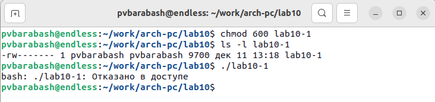

---
## Front matter
title: "Отчёт по лабораторной работе"
subtitle: "Лабораторная №10"
author: "Полина Витальевна Барабаш"

## Generic otions
lang: ru-RU
toc-title: "Содержание"

## Pdf output format
toc: true # Table of contents
toc-depth: 2
lof: true # List of figures
fontsize: 12pt
linestretch: 1.5
papersize: a4
documentclass: scrreprt
## I18n polyglossia
polyglossia-lang:
  name: russian
  options:
	- spelling=modern
	- babelshorthands=true
polyglossia-otherlangs:
  name: english
## I18n babel
babel-lang: russian
babel-otherlangs: english
## Fonts
mainfont: PT Serif
romanfont: PT Serif
sansfont: PT Sans
monofont: PT Mono
mainfontoptions: Ligatures=TeX
romanfontoptions: Ligatures=TeX
sansfontoptions: Ligatures=TeX,Scale=MatchLowercase
monofontoptions: Scale=MatchLowercase,Scale=0.9
## Biblatex
biblatex: true
biblio-style: "gost-numeric"
biblatexoptions:
  - parentracker=true
  - backend=biber
  - hyperref=auto
  - language=auto
  - autolang=other*
  - citestyle=gost-numeric
## Pandoc-crossref LaTeX customization
figureTitle: "Рис."
listingTitle: "Листинг"
lofTitle: "Список иллюстраций"
lolTitle: "Листинги"
## Misc options
indent: true
header-includes:
  - \usepackage{indentfirst}
  - \usepackage{float} # keep figures where there are in the text
  - \floatplacement{figure}{H} # keep figures where there are in the text
---

# Цель работы

Приобретение навыков написания программ для работы с файлами.

# Выполнение работы

**Задание №1.** 1. Создайте каталог для программам лабораторной работы № 10, перейдите в него и создайте файлы lab10-1.asm, readme-1.txt и readme-2.txt. 

Я создала каталог для программ лабораторной работы № 10 с помощью команды mkdir ~/work/arch-pc/lab10. Затем я перешла в него с помощью команды cd и создала файлы lab10-1.asm, readme-1.txt и readme-2.txt с помощью touch (рис. @fig:001).

{#fig:001 width=100%}

**Задание №2.** Введите в файл lab10-1.asm текст программы из листинга 10.1 (Программа записи в файл сообщения). Создайте исполняемый файл и проверьте его работу.

Я ввела текст программы в lab10-1.asm, изменив название файла с readme.txt на readme-1.txt. После этого создала исполняемый файл и проверила его работу (рис. @fig:002).

{#fig:002 width=100%}

Программа работает корректно. 

**Задание №3.** С помощью команды chmod измените права доступа к исполняемому файлу lab10-1, запретив его выполнение. Попытайтесь выполнить файл. Объясните результат.

С помощью команды chmod и с помощью записи прав доступа 600 (чтение и запись только для владельца), я запретила выполнение файла lab10-1. Затем попыталась его запустить и получила отказ из-за отсутствия прав доступа (рис. @fig:003).

{#fig:003 width=100%}

Закономерно, что файл не был запущен, так как я запретила исполнение владельцу, то есть себе.

**Задание №4.** С помощью команды chmod измените права доступа к файлу lab10-1.asm с исходным текстом программы, добавив права на исполнение. Попытайтесь выполнить его и объясните результат.

С помощью команды chmod и с помощью записи прав доступа 700 (чтение, запись и исполнение только для владельца), я добавила права на исполнение файла lab10-1.asm. Затем попробовала запустить его и увидела сообщения "нет управления заданиями" и "команда не найдена"(рис. @fig:004).

{#fig:004 width=100%}

Такой результат получается от того, что код программы необходимо перевести на машинный язык, без этого не возмножно его выполнить.

**Задание №5.** В соответствии с вариантом в таблице 10.4 предоставить права доступа к файлу readme-1.txt представленные в символьном виде, а для файла readme-2.txt – в двочном виде. Проверить правильность выполнения с помощью команды ls -l.

Мой вариант второй. Я использовала команду chmod для предоставления прав доступа к readme-1.txt, представленные в символьном виде. Я проверила правильность с помощью команды ls -l (рис. @fig:005).

{#fig:005 width=100%}

Затем я попыталась предоставить права доступа и для файла readme-2.txt в двочном виде. Однако система выдавала ошибку "неверный режим". Изучение дополнительной информации, кажется, свидетельствует, что задавать режим можно символьно или восьмерично. Я задала восьмерично из-за этой проблемы (рис. @fig:006).

{#fig:006 width=100%}

# Выполнение самостоятельной работы

**Задание №1.** Напишите программу работающую по следующему алгоритму:

• вывод приглашения “Как Вас зовут?”

• ввести с клавиатуры свои фамилию и имя

• создать файл с именем name.txt

• записать в файл сообщение “Меня зовут”

• дописать в файл строку введенную с клавиатуры

• закрыть файл

Создать исполняемый файл и проверить его работу. Проверить наличие файла и его содержимое с помощью команд ls и cat.

Я создала файл lab10-1-iw.asm и написала в нём программу. Я создала исполняемый файл и проверила работу программы, наличие файла и его содержимое (рис. @fig:007).

{#fig:007 width=100%}

Всё правильно. 

# Выводы

Я приобретела навыки написания программ для работы с файлами. Узнала, как создавать файлы в программе, как предоставлять права доступа в разных режимах. 
